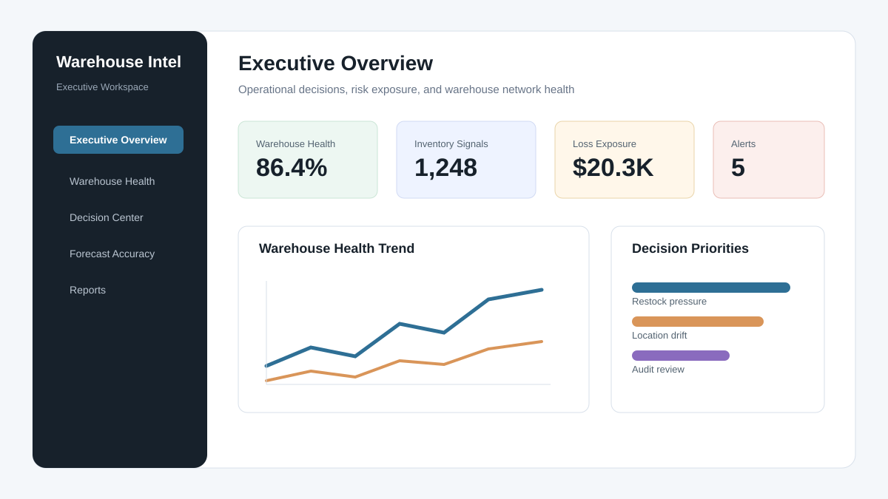
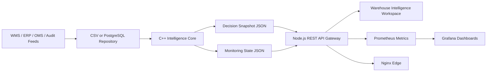
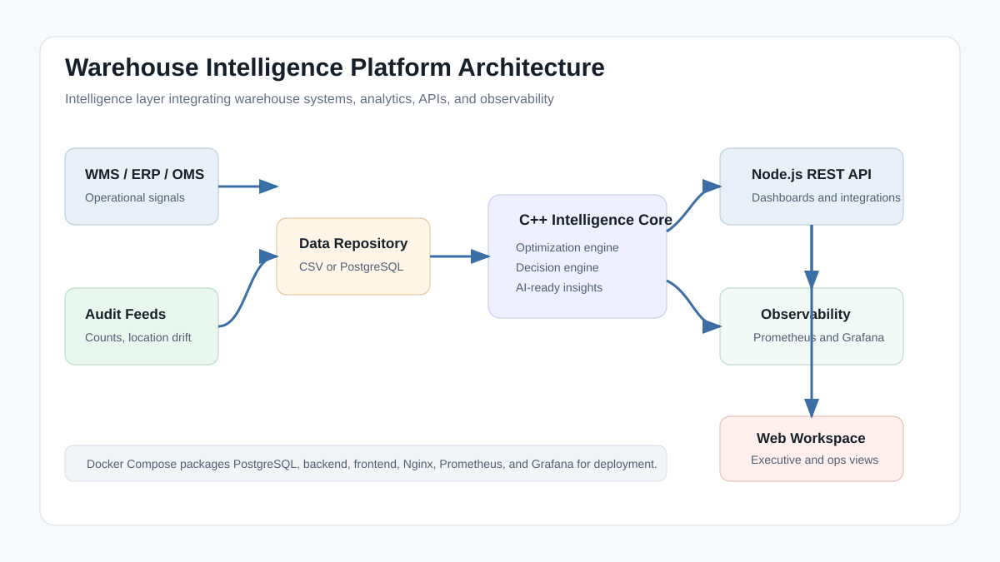
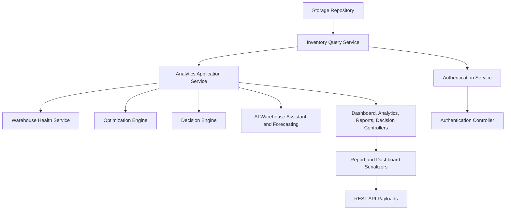
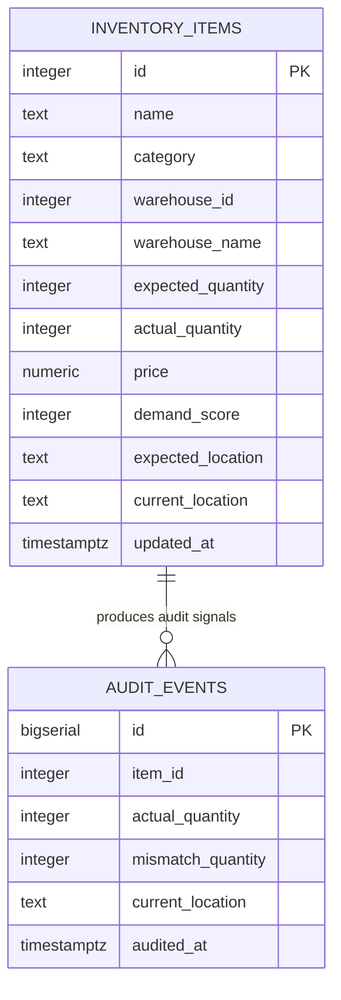
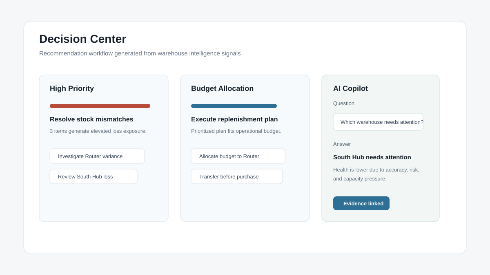
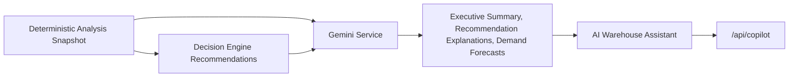
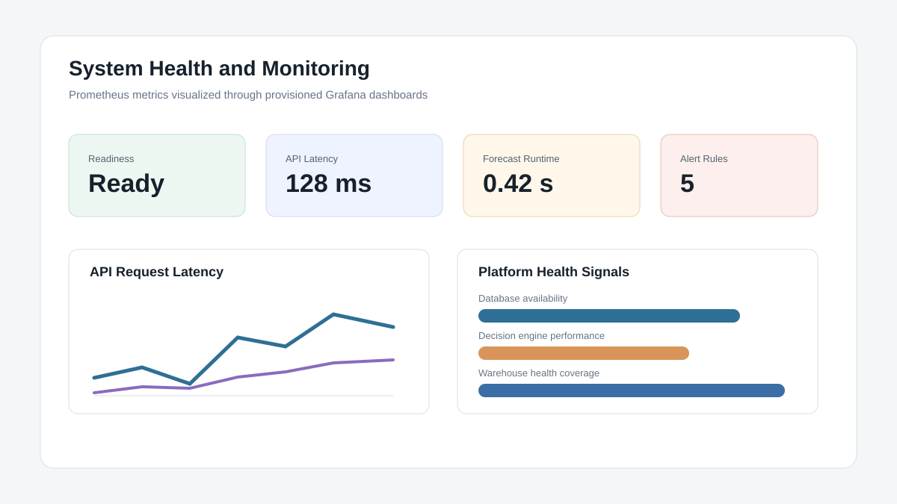

# Warehouse Intelligence Platform

An operational intelligence layer for modern warehouse networks. The platform integrates with Warehouse Management Systems, analyzes operational signals, and turns raw warehouse data into decision-ready insights for leaders, analysts, and operations teams.

This project is positioned as a **Warehouse Intelligence Platform**, not as a warehouse transaction system. It sits above existing WMS, ERP, order management, and audit workflows to help organizations understand risk, forecast demand pressure, prioritize warehouse actions, and improve operational decision-making.



## Target Industries

The platform is designed for industries where warehouse decisions directly affect fulfillment speed, availability, compliance, and cost.

| Industry | Example decision support |
|---|---|
| Quick Commerce | Identify stock pressure, fulfillment risk, and fast-moving shortage signals across micro-fulfillment hubs. |
| E-Commerce | Prioritize replenishment, anomaly review, and warehouse network actions before service levels degrade. |
| Retail | Detect shelf-location drift, stock mismatch trends, and store-to-warehouse operational risks. |
| Manufacturing | Support material availability, plant warehouse planning, and high-value component controls. |
| Healthcare | Flag critical supply variance, audit-sensitive products, and warehouse health degradation. |
| Logistics | Surface node-level health, transfer dependencies, and shipment support readiness. |
| Cold Storage | Monitor location discipline, capacity utilization, and risk patterns across temperature-controlled sites. |
| FMCG | Track high-velocity demand pressure, loss exposure, and replenishment priorities across distributed warehouses. |

## Product Vision

Warehouse operations create a constant stream of signals: expected stock, actual stock, demand, audit events, warehouse ownership, location accuracy, risk indicators, supplier performance, and decision outcomes. Most organizations already have systems that record these signals, but the decision layer is often fragmented across spreadsheets, dashboards, manual reviews, and delayed escalations.

The vision of this platform is to become the intelligence layer between operational systems and business action. It helps teams move from "what happened?" to "what should we do next?" by combining deterministic optimization, recommendation generation, AI-assisted explanation, REST APIs, observability, and deployment-ready infrastructure.

## Business Problem

Warehouse teams often face decisions that are time-sensitive and cross-functional:

- Which warehouse needs attention before fulfillment performance drops?
- Which products should be restocked first when the budget is constrained?
- Which stock mismatches indicate operational drift, shrinkage, or location control issues?
- Which items are becoming demand pressure points?
- Which recommendations should be escalated to managers, analysts, or audit teams?

Traditional warehouse systems are excellent at recording operations. The gap is interpretation: converting operational records into prioritized, explainable, and measurable decisions.

## Business Value

The platform helps organizations create measurable decision advantage across warehouse operations.

- Faster escalation: high-risk inventory, warehouse health issues, and audit windows are surfaced immediately.
- Better capital allocation: replenishment decisions are optimized against budget and business impact.
- Lower operational loss: mismatch, misplaced-item, and shrinkage signals are converted into targeted actions.
- Improved executive visibility: leaders get a concise view of health, risk, loss exposure, forecast accuracy, and service readiness.
- Stronger governance: authentication, audit-aware analytics, CI/CD, test coverage, and monitoring make the platform easier to review and operate.
- Integration readiness: REST APIs and repository abstractions support integration with WMS and enterprise data sources.

## System Architecture

The system is structured as a decision platform with a C++ intelligence core, a Node.js API gateway, a browser-based operations workspace, and production infrastructure around data, monitoring, and delivery.





### Architecture Responsibilities

| Layer | Responsibility |
|---|---|
| Data adapters | Load operational signals from CSV or PostgreSQL-compatible configuration. |
| C++ intelligence core | Runs analytics, optimization, audit interpretation, warehouse health scoring, recommendations, and AI-ready serialization. |
| Shared output layer | Publishes dashboard and monitoring state as stable JSON artifacts. |
| REST API gateway | Serves dashboards, analytics, authentication, copilot responses, health checks, readiness, and Prometheus metrics. |
| Web workspace | Provides executive, warehouse, inventory, forecast, decision, reports, audit, supplier, and administration views. |
| Observability stack | Prometheus scrapes metrics and Grafana provisions operational dashboards and alerts. |
| Delivery stack | Docker Compose runs PostgreSQL, backend, frontend, Nginx, Prometheus, and Grafana. GitHub Actions automates build, tests, coverage, static analysis, integration checks, and image builds. |

## Module Architecture



| Module | Business capability |
|---|---|
| Repository layer | Isolates data loading and future WMS/database integrations. |
| Warehouse services | Manage warehouse metadata, assignment validation, and health score calculation. |
| Analytics service | Builds a complete operational snapshot for decision-making. |
| Optimization engine | Prioritizes restock, risk, anomaly, network, and audit signals. |
| Decision engine | Converts analytics into business recommendations with rationale and actions. |
| AI assistant | Answers operational questions using deterministic outputs and forecast summaries. |
| REST controllers | Expose platform capabilities through API-ready response contracts. |
| Monitoring registry | Captures execution timings and business gauges for Prometheus export. |

## Database Design

The platform currently supports CSV-backed operation and PostgreSQL deployment configuration. PostgreSQL schema bootstrap lives in `deploy/postgres/init.sql`.



### Core Data Concepts

| Entity | Purpose |
|---|---|
| Inventory item | Represents a warehouse-tracked product signal used for analytics and recommendations. |
| Warehouse ownership | Associates operational signals with a warehouse node. |
| Audit event | Captures point-in-time evidence for mismatch timing, frequency, and anomaly context. |
| Analysis snapshot | Aggregates mismatch, risk, optimization, graph, forecast, health, and recommendation outputs. |

## Optimization Engine

The optimization engine supports business capabilities. Its implementation uses classic data structures and algorithms, but those algorithms are intentionally presented as internals that power operational decisions.

| Business capability | Implementation detail | Outcome |
|---|---|---|
| Stock variance detection | Hash-based lookup and aggregation | Identifies mismatches, total loss exposure, frequency, and recommended correction actions. |
| High-risk prioritization | Heap-based ranking | Surfaces the most urgent items for manager review. |
| Budget-aware replenishment | Dynamic Programming knapsack | Selects the best replenishment plan under budget constraints. |
| Risk classification | Greedy threshold scoring | Classifies operational urgency as high, medium, or low. |
| Network and cluster analysis | Graph traversal with BFS/DFS | Finds linked warehouse-item clusters that may indicate systemic location or shrinkage issues. |
| Audit timing | Binary Search over ordered audits | Detects the first audit window where loss became visible. |

These internals are valuable because they make the decision layer deterministic, explainable, and testable.

## Decision Engine

The decision engine translates analytics into recommendations that operations teams can act on.

Recommendation categories include:

- `inventory-control`: resolve stock mismatches and shrinkage indicators.
- `risk-prioritization`: review highest-risk items first.
- `budget-allocation`: execute the most valuable replenishment plan within budget.
- `operational-triage`: focus teams on high-urgency items.
- `warehouse-network`: review linked warehouse clusters and transfer dependencies.
- `audit-intelligence`: investigate first-seen mismatch windows.

Each recommendation includes category, priority, title, rationale, related item IDs, and bounded action steps.



## AI Architecture

The AI layer is designed to explain and summarize deterministic operational outputs, not replace them.



### AI Principles

- Deterministic algorithms remain the source of truth.
- AI explanations are generated only from existing analysis and recommendations.
- Forecasting has a deterministic fallback when an external model is disabled or unavailable.
- The assistant answers constrained operational questions such as warehouse attention, restock products, demand changes, and health reasons.

## REST API Documentation

The Node.js API gateway exposes the platform for dashboards, integrations, health checks, and observability.

| Method | Endpoint | Purpose |
|---|---|---|
| `GET` | `/health` | Liveness check with service metadata. |
| `GET` | `/ready` | Readiness check for dashboard payload, configuration, and database probe. |
| `GET` | `/metrics` | Prometheus metrics endpoint. |
| `GET` | `/api/dashboard` | Full dashboard payload for the web workspace. |
| `GET` | `/api/inventory` | Warehouse and item signal payload. |
| `GET` | `/api/analytics` | Mismatch, risk, optimization, cluster, and audit analytics. |
| `GET` | `/api/decision-center` | Decision recommendations and supporting context. |
| `GET` | `/api/warehouse-health` | Warehouse health scores and operational health components. |
| `GET` | `/api/reports` | Combined reporting payload for inventory, analytics, decisions, and summary. |
| `POST` | `/api/auth/login` | Authenticates configured platform users. |
| `POST` | `/api/copilot` | Answers supported operational questions from platform intelligence. |

### Example Requests

```bash
curl http://localhost:8080/health
curl http://localhost:8080/api/dashboard
curl http://localhost:8080/api/warehouse-health
curl -X POST http://localhost:8080/api/auth/login \
  -H "Content-Type: application/json" \
  -d '{"username":"admin","password":"your-password"}'
curl -X POST http://localhost:8080/api/copilot \
  -H "Content-Type: application/json" \
  -d '{"question":"Which warehouse needs attention?"}'
```

## Security

Security controls are implemented at the platform layer and are suitable for a demonstrable production-style architecture.

- Password verification uses SHA-256 hashes supplied through configuration or environment variables.
- Role-bearing user accounts support Admin, Warehouse Manager, Analyst, and Viewer personas.
- API responses never expose plaintext passwords.
- Runtime configuration is externalized through environment variables.
- Nginx is used as the edge service in Docker deployments.
- Health, readiness, and metrics endpoints support operational governance.
- CI runs tests, coverage, static analysis, and Docker image builds before changes are accepted.

For enterprise production use, recommended next steps include managed secret storage, OAuth/OIDC integration, TLS termination, request rate limiting, audit logging persistence, and least-privilege database credentials.

## Docker

The Docker setup runs the complete platform stack.

| Service | Purpose |
|---|---|
| `postgres` | PostgreSQL database with schema initialization. |
| `backend` | C++ intelligence engine running in service mode. |
| `frontend` | Node.js REST API gateway and static web workspace. |
| `nginx` | HTTP edge proxy. |
| `prometheus` | Metrics collection and alert evaluation. |
| `grafana` | Provisioned operational dashboards. |

```bash
docker compose up --build
```

Default service URLs:

| Service | URL |
|---|---|
| Platform UI | `http://localhost` |
| Frontend API container | `http://localhost:8080` inside development runs |
| Prometheus | `http://localhost:9090` |
| Grafana | `http://localhost:3000` |

Development overlay:

```bash
docker compose -f docker-compose.yml -f docker-compose.dev.yml up --build
```

## CI/CD

GitHub Actions executes the delivery checks automatically on push and pull request.

```mermaid
flowchart LR
    Checkout["Checkout"] --> Node["Set up Node.js"]
    Node --> Deps["Install C++ and test dependencies"]
    Deps --> Build["Build backend"]
    Build --> GTest["Run GoogleTest suite"]
    GTest --> Coverage["Generate gcovr coverage"]
    Coverage --> Integration["Run integration tests"]
    Integration --> Artifact["Upload coverage artifact"]
    Artifact --> Static["Run cppcheck"]
    Static --> Docker["Build Docker images"]
```



CI coverage includes:

- Backend compilation.
- GoogleTest suite execution.
- Coverage report generation with `gcovr`.
- End-to-end integration smoke tests.
- Static analysis with `cppcheck`.
- Docker image build validation.

## Monitoring

Prometheus and Grafana are integrated as first-class operational components.



### Metrics Exposed

| Metric area | Examples |
|---|---|
| API performance | Request count, route count, response status, latency histogram. |
| Business health | Warehouse count, inventory count, mismatch count, misplaced count, loss value. |
| Decision performance | Decision engine execution time, recommendation count, decision failures. |
| Forecast performance | Forecast execution time, forecast count, forecast failure count, derived accuracy. |
| Database | Availability and latency probe. |
| Authentication | Login attempts by success or failure. |
| System health | Uptime, readiness state, health endpoint state, build metadata. |

### Grafana Dashboards

Provisioned dashboards:

- Executive Overview
- Warehouse Health
- Inventory KPIs
- Forecast Accuracy
- Decision Engine Performance
- API Performance
- Database Performance
- System Health

### Alert Rules

Prometheus alert rules cover:

- Database unavailable
- High API latency
- Forecast failures
- Decision Engine failures
- Health endpoint failures

## Testing Strategy

The repository uses GoogleTest for automated backend coverage and a shell-based integration test for platform-level validation.

| Test category | Coverage focus |
|---|---|
| Unit tests | Password hashing, item derivation, monitoring registry behavior. |
| Repository tests | CSV reader, CSV repository, PostgreSQL repository adapter behavior, repository factory, repository configuration. |
| Service tests | Warehouse operations, warehouse health, analytics snapshot, insights, recommendations. |
| API tests | Controller payloads for inventory, analytics, dashboard, reports, decisions, copilot, and warehouse health. |
| Integration tests | Repository-to-analytics-to-dashboard flow and authentication-to-decision flow. |
| Authentication tests | Login service, authentication controller, role-bearing sessions. |
| Decision Engine tests | Recommendation categories, bounded actions, rationale quality. |
| Forecasting tests | Deterministic AI fallback and assistant demand responses. |
| Optimization tests | Hash, heap, dynamic programming, greedy, graph, Binary Search audit timing, and audit history. |

Run locally:

```bash
cd backend
make unit-test
make coverage
```

Run integration smoke tests:

```bash
bash scripts/integration-test.sh
```

Coverage output:

```text
backend/coverage/coverage.xml
backend/coverage/index.html
```

## Deployment Guide

### 1. Configure Environment

Create a `.env` file from `.env.example` and set values for the runtime.

```bash
POSTGRES_DB=smart_inventory
POSTGRES_USER=postgres
POSTGRES_PASSWORD=postgres
SMARTINVENTORY_REPOSITORY_BACKEND=csv
SMARTINVENTORY_STARTUP_MODE=demo
SMARTINVENTORY_SERVICE_REFRESH_SECONDS=30
SMARTINVENTORY_VERSION=local
NGINX_PORT=80
PROMETHEUS_PORT=9090
GRAFANA_PORT=3000
GRAFANA_ADMIN_USER=admin
GRAFANA_ADMIN_PASSWORD=admin
```

### 2. Build and Start the Stack

```bash
docker compose up --build
```

### 3. Verify Runtime Health

```bash
curl http://localhost/health
curl http://localhost/ready
curl http://localhost/metrics
```

### 4. Open Dashboards

- Platform workspace: `http://localhost`
- Prometheus: `http://localhost:9090`
- Grafana: `http://localhost:3000`

### 5. Production Hardening Checklist

- Replace default passwords and use hashed credentials.
- Store secrets in a managed secret manager.
- Run behind TLS.
- Configure backup and retention for PostgreSQL.
- Connect repository adapters to enterprise WMS or data warehouse feeds.
- Configure alert notification routing in Alertmanager or Grafana.
- Run CI checks before release promotion.

## Screenshots

The repository includes GitHub-renderable product visuals that represent the current workspace areas and monitoring surfaces.

| Executive Overview | Decision Center |
|---|---|
|  |  |

| Monitoring | System Architecture |
|---|---|
|  |  |

## Architecture Diagrams

This README includes Mermaid diagrams for system architecture, module architecture, database design, AI flow, and CI/CD. The `docs/assets` folder also contains SVG diagrams for environments where Mermaid rendering is unavailable.

## Project Structure

```text
SmartInventory_CPP/
  backend/
    include/                 C++ domain, services, repositories, controllers
    src/                     C++ intelligence core implementations
    tests/                   GoogleTest test suite
    config/                  Runtime configuration
  frontend/
    pages/                   Warehouse Intelligence workspace pages
    services/                Browser API clients
    server.js                Node.js REST API and Prometheus exporter
  deploy/
    nginx/                   Edge proxy configuration
    postgres/                PostgreSQL schema bootstrap
    monitoring/              Prometheus and Grafana provisioning
  scripts/
    integration-test.sh      End-to-end smoke test
  .github/workflows/
    ci.yml                   Build, test, coverage, analysis, Docker CI
```

## Future Roadmap

- Native WMS connectors for inbound operational events and outbound recommendations.
- Persistent PostgreSQL repository implementation with full CRUD and audit history storage.
- Role-based access control policies across API endpoints.
- Alertmanager notification routing for Slack, email, PagerDuty, or Teams.
- Forecast model evaluation with accuracy tracking against actual demand outcomes.
- Warehouse digital twin view for capacity, transfer, and fulfillment simulation.
- Multi-tenant organization support.
- Event streaming ingestion through Kafka or cloud pub/sub.
- Recommendation workflow states such as assigned, accepted, rejected, completed, and escalated.
- Enterprise SSO through OIDC/SAML.
- Production-grade secret management and audit log retention.

## Interview Notes

This project demonstrates:

- C++17 backend engineering with modular services and deterministic analytics.
- Data structure and algorithm usage applied to business decision support.
- REST API design and Node.js gateway implementation.
- Dockerized multi-service deployment.
- PostgreSQL-ready data design.
- Prometheus and Grafana observability.
- GoogleTest coverage and CI/CD automation.
- Product thinking: the platform is framed around operational outcomes, not just technical implementation.
